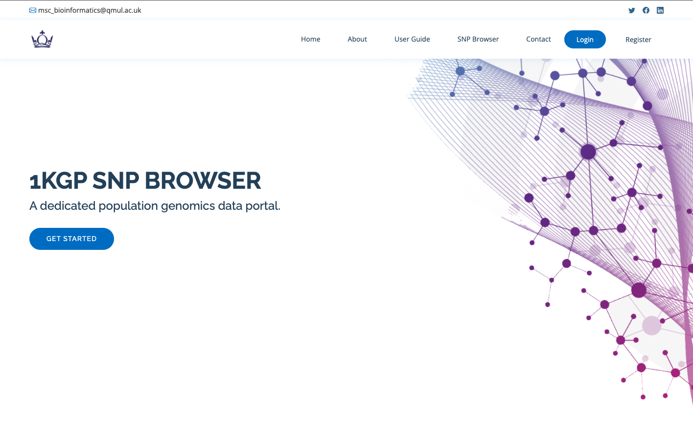
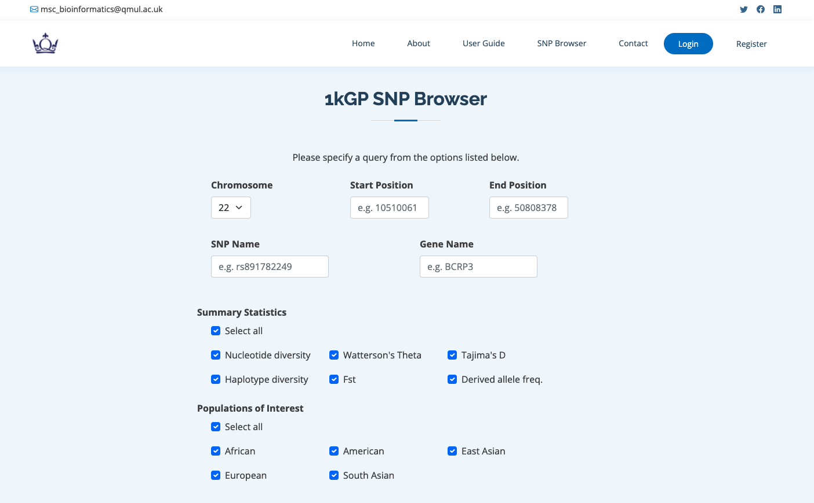

# 1kGP SNP Browser

The 1kGP SNP browser is a data portal designed to process and analyze human variation data sourced from the [1000 Genomes 30x on GRCh38](https://www.internationalgenome.org/data-portal/data-collection/30x-grch38) dataset. It was built on Python using Flask for the webserver and Dash for the visualisations. Data was stored using a novel compressed file format: zarr. Full details on how to use the tool included in the user guide and design choices in the documentation.

How to run locally on Python 3:

-- Create a local 'uploads' folder inside the website folder. 

```no-highlight
pip3 install -r requirements.txt
python3 main.py
```

The 1kGP SNP browser is avaiable at [1kgpsnpbrowser.rf.gd](https://final-1kgp-snp-browser-qydhtixa5a-ew.a.run.app)





